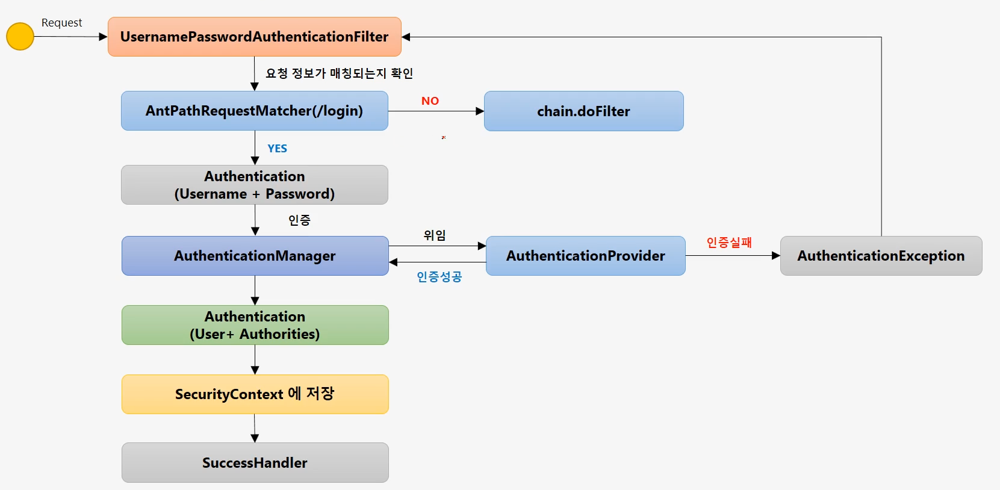
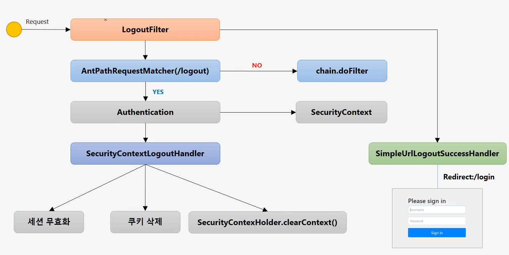

## 1. 스프링 시큐리티 기본 API 및 Filter 이해

### 로그인 시 Security 관련 filter 작동 순서

- `UsernamePasswordAuthenticationFilter`: 사용자 요청을 받아 로그인 인증처리 담당
- `AntPathRequestMatcher`: 해당 요청 정보가 입력된 경로와 일치하는지 확인
  - default: /login
  - loginProcessingUrl 에 등록된 링크로 match 확인
  - 일치하지 않는 경우 chain.doFilter 전달
  - 일치하는 경우 `Authentication` 객체 생성해 로그인 유저 정보 저장 (Username + Password)
- `AuthenticationManager`: 인증객체 전달받아 인증처리 진행
  - 내부적으로 `AuthenticationProvider` 가지는데 이 중 하나에 인증 위임 -> 실제로 인증 담당
  - 인증 실패 시 `AuthenticationException` 발생
  - 인증 성공 시 새로운 인증정보 담긴 `Authentication` 객체 생성 (User + Authorities)
- `SecurityContext`: 최종 인증 정보 저장되는 저장소. 세션에도 저장됨
- `SuccessHandler`: 인증 성공 이후 작업 처리

---

### 로그아웃 시 관련 filter 작동

- GET 방식은 원칙적으로 오류 발생 -> POST 방식으로 요청
- `LogoutFilter`: 요청을 받아 로그아웃 인증 처리 담달
- `AntPathRequestMatcher`: 해당 요청 정보가 입력된 경로와 일치하는지 확인
  - default: /logout
  - 일치하지 않는 경우 chain.doFilter 전달
  - 일치하는 경우 `SecutiryContext` 에서 `Authentication` 인증객체 꺼내와 LogoutHandler 에 전달
- `SecurityContextLogoutHandler`
  - 세션 무효화
  - 쿠키 삭제
  - `SecurityContextHolder.clearContext()`: SecurityContext 삭제
- `SimpleUrlLogoutSuccessHandler`: 로그아웃 성공 시 작동해 설정 페이지로 리다이렉션